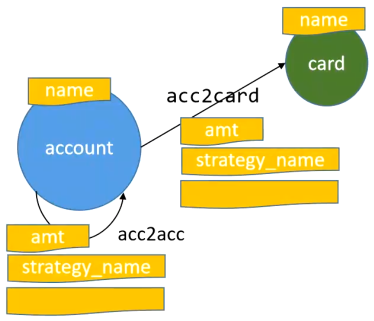
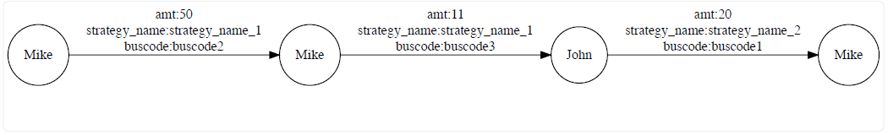
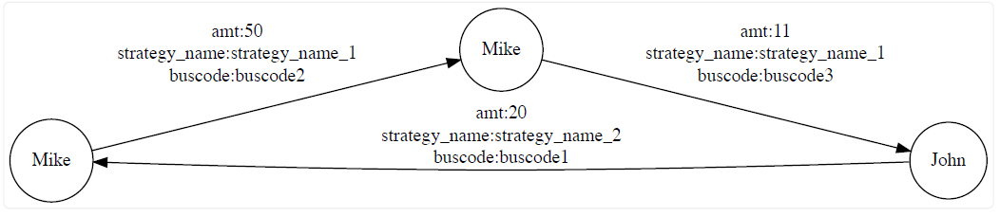
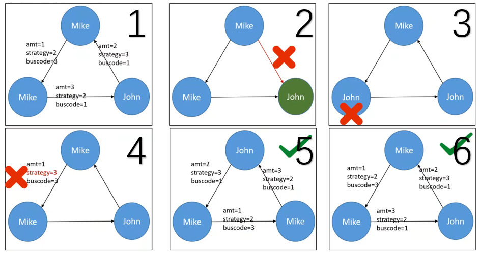
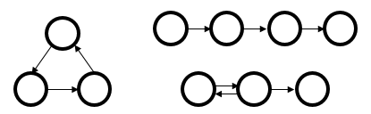

# Homework 10: Graph Mining

Introduction to Big Data Systems course

**Due: December 1, 2024** 23:59 China time. Late submission results in lower (or even no) scores.

For questions or concerns, contact TA (Yanzheng Cai) by WeChat. Or send an email to cyz22@mails.tsinghua.edu.cn if you could not use WeChat. 


## Overview

Graph mining algorithms aim at identifying structural patterns of graphs. In this assignment, you will implement a frequent subgraph mining (FSM) algorithm on labeled graphs. 


## Environment

You may use any programming language. You may run the program anywhere (e.g., the server or your PC). 

Be careful of the space complexity and the time complexity of your program. 


## Frequent Subgraph Mining

Frequent Subgraph Mining (FSM) aims at discovering interesting patterns in a labeled graph. Given the **support** parameter and the **pattern size**, it counts embeddings of the patterns whose appearances exceed the threshold. Since **support** is essentially a threshold to filter out subgraph pattern whose frequency does not meet the threshold, the larger support is, the better the performance is. Labeled patterns with the same topology, in this formulation, are different if their labels differ (i.e. the definition of isomorphism is expanded to include labels). 


## What you need to do?

FSM is widely used in financial risk management, such as anti-money laundering. The FSM algorithms help discover abnormal behavior patterns that appear in high frequency. This assignment uses a simplified financial dataset. You need to implement a FSM algorithm to discover subgraph patterns, with **support >= 10000** and **pattern size = 3** (i.e. there are 3 directed edges in the subgraph pattern). 

Note: the definition of isomorphism is expanded to include labels. Detailed matching rules are described in the Section of [Dataset](#dataset).


## Dataset

We have placed dataset on the server at: `/data/hw10_data`

If you want to do this assignment on your own computer, you can also download the dataset from: https://cloud.tsinghua.edu.cn/d/51fab6488d6b4239ab54/

There are 5 files after unzipping `bdci_data.tar.gz`: 

```bash
data
├── account
├── account_to_account
├── account_to_card
├── card
└── schema.txt 
```

As shown in the figure below,

- `account` and `card` are two types of vertices sharing the same fields.
- `account_to_account` and `account_to_card` are two types of edges sharing the same fields.



- vertex type

  |   Field   |  Type  | Description | Comparison of Subgraph Isomorphism |
  | :-------: | :----: | :---------: | :--------------------------------: |
  |    id     | INT64  | PRIMARY KEY |                 No                 |
  |   name    | STRING |    name     |       Yes, strict comparison       |
  | timestamp | INT64  |    time     |                 No                 |
  |   black   | INT32  | seed vertex |                 No                 |

- edge type

  |     Field     |  Type  |   Description   |         Comparison of Subgraph Isomorphism         |
  | :-----------: | :----: | :-------------: | :------------------------------------------------: |
  |   source_id   | INT64  |    source ID    |                         No                         |
  |   target_id   | INT64  |    target ID    |                         No                         |
  |   timestamp   | INT64  |      time       |                         No                         |
  |      amt      | DOUBLE | amount of money | Yes, compare after rounding to the nearest integer |
  | strategy_name | STRING |  strategy name  |               Yes, strict comparison               |
  |   trade_no    | INT64  |  trade number   |                         No                         |
  |    buscode    | STRING |  business code  |               Yes, strict comparison               |
  |     other     |   -    |        -        |                         No                         |


## Input Format

A labeled directed graph with 4 input files (`account`, `card`, `account_to_account` and `account_to_card`) as we discussed before.


## Output Format

Store a list of discovered subgraph patterns to a **JSON** file.

For example, there are two subgraph patterns：

- The frequency of pattern 1 is 12345

  

- The frequency of pattern 2 is 23456

  

The corresponding output is:

```json
[
    {
        "frequency": 12345,
        "nodes": [
            {
                "node_id": 0,
                "name": "Mike"
            },
            {
                "node_id": 1,
                "name": "Mike"
            },
            {
                "node_id": 2,
                "name": "John"
            },
            {
                "node_id": 3,
                "name": "Mike"
            }
        ],
        "edges": [
            {
                "source_node_id": 0,
                "target_node_id": 1,
                "amt": 50.0,
                "strategy_name": "strategy_name-1",
                "buscode": "buscode2"
            },
            {
                "source_node_id": 1,
                "target_node_id": 2,
                "amt": 11.0,
                "strategy_name": "strategy_name-1",
                "buscode": "buscode3"
            },
            {
                "source_node_id": 2,
                "target_node_id": 3,
                "amt": 20.0,
                "strategy_name": "strategy_name-2",
                "buscode": "buscode1"
            }
        ]
    },
    {
        "frequency": 23456,
        "nodes": [
            {
                "node_id": 0,
                "name": "Mike"
            },
            {
                "node_id": 1,
                "name": "Mike"
            },
            {
                "node_id": 2,
                "name": "John"
            }
        ],
        "edges": [
            {
                "source_node_id": 0,
                "target_node_id": 1,
                "amt": 50.0,
                "strategy_name": "strategy_name-1",
                "buscode": "buscode2"
            },
            {
                "source_node_id": 1,
                "target_node_id": 2,
                "amt": 11.0,
                "strategy_name": "strategy_name-1",
                "buscode": "buscode3"
            },
            {
                "source_node_id": 2,
                "target_node_id": 0,
                "amt": 20.0,
                "strategy_name": "strategy_name-2",
                "buscode": "buscode1"
            }
        ]
    }
]
```

Note: 

- You can rearrange the node ID in your output, as long as it won't affect the topology of the subgraph pattern. 
- The `frequency` field is optional and it won't affect your score.


## Further Explanation of Subgraph Isomorphism



- Subgraph 1 and 2 are not isomorphic because of the wrong edge direction.

- Subgraph 1 and 3 are not isomorphic because one vertex is mismatching.

- Subgraph 1 and 4 are not isomorphic because one edge is mismatching.

- Obviously, subgraph 1, 5 and 6 are isomorphic.

- Subgraph 1 and 5 are considered to be the **same pattern**. That is, the following two outputs are equivalent:

  ```json
  {
      "nodes": [
          {
              "node_id": 0,
              "name": "Mike"
          },
          {
              "node_id": 1,
              "name": "John"
          },
          {
              "node_id": 2,
              "name": "Mike"
          }
      ],
      "edges": [
          {
              "source_node_id": 0,
              "target_node_id": 1,
              "amt": 3.0,
              "strategy_name": "2",
              "buscode": "1"
          },
          {
              "source_node_id": 1,
              "target_node_id": 2,
              "amt": 2.0,
              "strategy_name": "3",
              "buscode": "1"
          },
          {
              "source_node_id": 2,
              "target_node_id": 0,
              "amt": 1.0,
              "strategy_name": "2",
              "buscode": "3"
          }
      ]
  }
  ```

  ```json
  {
      "nodes": [
          {
              "node_id": 0,
              "name": "Mike"
          },
          {
              "node_id": 1,
              "name": "Mike"
          },
          {
              "node_id": 2,
              "name": "John"
          }
      ],
      "edges": [
          {
              "source_node_id": 0,
              "target_node_id": 1,
              "amt": 1.0,
              "strategy_name": "2",
              "buscode": "3"
          },
          {
              "source_node_id": 1,
              "target_node_id": 2,
              "amt": 3.0,
              "strategy_name": "2",
              "buscode": "1"
          },
          {
              "source_node_id": 2,
              "target_node_id": 0,
              "amt": 2.0,
              "strategy_name": "3",
              "buscode": "1"
          }
      ]
  }
  ```


## Scoring

### Part 1 (60%)

You will get full scores of this part if you discover at least **6 different subgraph patterns**. We have provided a `result_demo.json` only for reference.

### Part 2 (20%)

The more patterns you discover, the higher scores you will get.

### Report (20%)

Your report should at least contains:

- Brief description of your implementation

- Number of subgraph patterns you have discovered

- Visualization of the topology of the subgraph patterns you have discovered (ignore labels)

  For example:

  

- How to run your program successfully


## Hand-in

Please submit your assignment containing your report, code and the result file (`bdci_data.json`). 


## References

> 1. https://www.datafountain.cn/competitions/586
> 2. ELSEIDY, M., ABDELHAMID, E., SKIADOPOULOS, S., AND KALNIS, P. Grami: Frequent subgraph and pattern mining in a single large graph.  VLDB 2014.
> 3. Carlos H. C. Teixeira, Alexandre J. Fonseca, Marco Serafini, Georgos Siganos, Mohammed J. Zaki, and Ashraf Aboulnaga. Arabesque: a system for distributed graph mining. SOSP 2015.
> 4. Kai Wang, Zhiqiang Zuo, John Thorpe, Tien Quang Nguyen, and Guoqing Harry Xu. Rstream: Marrying relational algebra with streaming for efficient graph mining on A single machine. OSDI 2018. 
> 5. Daniel Mawhirter, Bo Wu. AutoMine: harmonizing high-level abstraction and high performance for graph mining. SOSP 2019.
