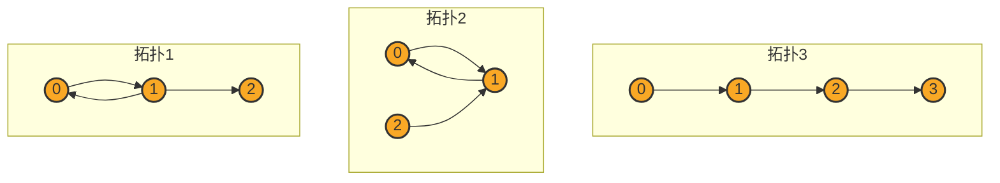

# HW10 Report
## 文件结构
```
BIGDATASYSTEM_HW10
├── report.md
├── report.pdf
├── fsm.py
├── convert.py
├── hw10_data
├── bdci_data.json
└── output
    ├── line_topo.txt
    ├── cycle_with_edge_topo.txt
    └── cycle_with_edge_in_topo.txt
```
* `report.md`：本报告
* `report.pdf`：本报告的 PDF 版本
* `fsm.py`：频繁子图挖掘算法的实现
* `convert.py`：将输出数据转化为要求的json格式
* `hw10_data`：数据集
* `bdci_data.json`：输出的json格式文件
* `output`：中间结果输出文件夹

## 运行方式
对原始数据进行处理，挖掘频繁子图：
```bash
python3 fsm.py
```
将输出数据转化为要求的json格式：
```bash
python3 convert.py
```

## 代码逻辑
### 数据读取
对数据的处理比较简单，由于使用`python`编写程序，几乎不需要考虑运行内存的问题，可直接将所有点与边一次性读入内存；观察数据后，对于`card`，将其`id`加`800000`以与`account`区分，则所有点的`id`互不相同，可直接使用`id`作为点的标识，使用一个字典存储点的信息；将`account`的`id`完成映射后的所有边以源点为键，目标点为第二个键，边的信息的列表为值存储在字典中，构成边的字典存储；为了找到指向同一顶点的两条边，还需要将所有边以目标点为键，源点为第二个键，边的信息的列表为值存储在另一个字典中，构成逆边的字典存储。

### 频繁子图挖掘
由于本次作业的要求的边数极少`(size=3)`，可以直接使用枚举方法进行频繁子图挖掘。由于时间所限，本次作业我只实现了5种拓扑的3边频繁子图挖掘，其中两种三角形拓扑（三边循环及两边同向一边反向）没有发现频繁子图，另外三种拓扑存在频繁子图。
例如当三条边依次首尾相连时，可先遍历所有的点，对于每个点找到所有其能到达的邻点1，再对邻点1找到其能到达的邻点2，最后判断邻点2是否能到达原点，若能则找到一个频繁子图。
又如当三条边依次连接，但不构成环时，可先遍历所有的点，对于每个点找到所有其能到达的邻点1，再对邻点1找到其能到达的邻点2，再对邻点2找到其能到达的邻点3，即可找到一个频繁子图。

### 数据转化
按照题目要求，读取上一步的输出，将频繁子图的信息转化为json格式，即将频繁子图的点与边的信息转化为json格式的字典，再将字典写入文件。

## 失败尝试
尝试复现`ScaleMine`算法，但在完成环境配置后，发现`ScaleMine`的代码无法正常运行：在完成挖掘后，其并行部分被通信卡住，无法正常退出；同时在小图情况下该框架似乎将所有情况都剪枝掉了；猜测十年前的`MPI`没有对悬挂等待信息进程的检测，故代码里`bug`未完全展现，在反复调试均未成功后放弃了这一尝试。

## 实验结果
目前共发现不同的频繁子图2782种，具体内容见`bdci_data.json`，其中拓扑1有35种，拓扑2有36种，拓扑3有2711种。
三种拓扑可视化如下：
